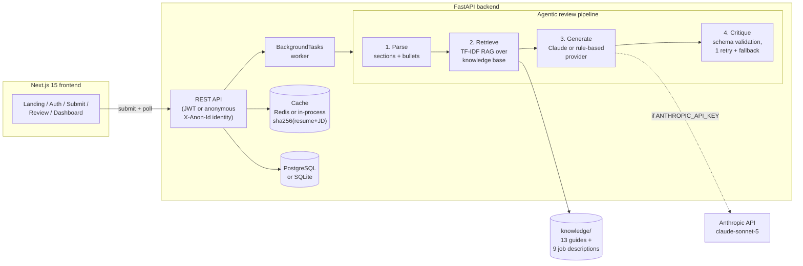

# AI Resume Reviewer ("Resumate")

A full-stack, AI-powered resume review app. Upload a resume (PDF or plain
text), optionally paste a target job description, and get a scored,
section-by-section review with concrete bullet rewrites and keyword-match
analysis — generated by an **agentic Claude workflow grounded in a small
local RAG pipeline** over curated hiring guides and sample job descriptions.

**Stack:** FastAPI · Next.js 15 (App Router, TypeScript, Tailwind) · SQLAlchemy
(PostgreSQL / SQLite) · Anthropic SDK (`claude-sonnet-5`) · JWT auth · Redis or
in-process caching · Docker · GitHub Actions.

**Frictionless demo:** the UI requires **no sign-up** — the frontend generates
a per-browser anonymous ID (stored in localStorage, sent as an `X-Anon-Id`
header) and the backend scopes reviews and dashboard history to it. Full JWT
register/login remains available through the API (see the auth endpoints
below); a valid bearer token always takes precedence over the anonymous ID.

## Architecture



**The agentic workflow** (`backend/app/agents/pipeline.py`):

1. **Parse** — a deterministic parser structures the raw resume into
   canonical sections and bullet points.
2. **Retrieve** — a local RAG pipeline (TF-IDF embeddings behind a pluggable
   `Embedder` interface, cosine similarity) pulls the most relevant chunks
   from `backend/knowledge/` (resume-writing guides + sample job
   descriptions) to ground the review.
3. **Generate** — the active provider produces a structured review:
   engineered system prompt + few-shot example + strict JSON contract for
   Claude, or the deterministic rule-based analyzer.
4. **Critique** — the candidate review is validated against a strict
   Pydantic schema; on failure the generator is retried once with the same
   inputs, then the pipeline falls back to the deterministic provider so a
   review is always produced.

## Two review modes (honest disclosure)

| Mode | When | What it does |
| --- | --- | --- |
| **Claude** | `ANTHROPIC_API_KEY` is set | Calls `claude-sonnet-5` via the Anthropic SDK with RAG-grounded prompts; output validated by the critic pass. |
| **Rule-based** | No API key | A deterministic analyzer (action-verb usage, quantification rate, section presence, length, weak-phrase detection, JD keyword overlap) that emits the **exact same JSON schema**. The full app — auth, upload, async processing, caching, dashboard — works end-to-end without any key, network, or Docker. |

The UI and API label every review with the provider that produced it.

## Quickstart (no Docker, no Postgres, no API key needed)

**Backend** (Python 3.12+):

```bash
cd backend
python -m venv .venv
.venv/Scripts/pip install -r requirements.txt   # Windows
# .venv/bin/pip install -r requirements.txt     # macOS/Linux
.venv/Scripts/python -m uvicorn app.main:app --port 8000
```

**Frontend** (Node 20+):

```bash
cd frontend
npm install
npm run dev   # http://localhost:3000, expects the API on http://localhost:8000
```

With no environment variables set, the backend uses a local SQLite file, an
in-process TTL cache, and the rule-based provider. To enable Claude reviews:

```bash
cp backend/.env.example backend/.env   # then set ANTHROPIC_API_KEY
```

**Docker (full stack with Postgres + Redis):**

```bash
docker compose up --build
```

**Tests:**

```bash
cd backend
.venv/Scripts/python -m pytest -v
```

## API

Review/history endpoints accept **either** identity: `Authorization: Bearer
<JWT>` (takes precedence) or `X-Anon-Id: <8-64 chars of A-Za-z0-9_->`. The UI
uses the anonymous header exclusively; requests with neither get a `401`.

| Method | Path | Identity | Description |
| --- | --- | --- | --- |
| `POST` | `/auth/register` | — | Create an account, returns a JWT |
| `POST` | `/auth/login` | — | Log in, returns a JWT |
| `GET` | `/auth/me` | JWT only | Current registered user |
| `POST` | `/reviews` | JWT or anon | Submit resume text (+ optional JD) — returns `202` and processes in the background |
| `POST` | `/reviews/upload` | JWT or anon | Submit a PDF (multipart, 5 MB max) + optional JD |
| `GET` | `/reviews/{id}` | JWT or anon | Poll review status; includes the full result when `completed` |
| `GET` | `/history` | JWT or anon | The identity's past reviews (newest first) |
| `GET` | `/health` | — | Liveness + active provider + knowledge-chunk count |

**Async flow:** submission returns immediately with `status: "pending"`; a
FastAPI `BackgroundTasks` worker runs the pipeline and the client polls
`GET /reviews/{id}` until `completed` or `failed`. Identical
(resume, JD, provider) submissions are served instantly from the cache
(SHA-256 key over the inputs, 24 h TTL).

## Project layout

```
backend/
  app/
    agents/        # parser, rule-based analyzer, providers, pipeline
    routers/       # auth, reviews, history
    services/      # pdf extraction, RAG (TF-IDF embedder + retrieval)
    auth.py        # PBKDF2 hashing + JWT + anonymous X-Anon-Id identities
    cache.py       # Redis / in-process TTL cache
    config.py      # env-driven settings with local fallbacks
  knowledge/       # 13 resume guides + 9 sample job descriptions (RAG corpus)
  tests/           # 36 pytest tests (all keyless)
frontend/
  src/app/         # landing, submit, review/[id], dashboard (no login needed)
  src/components/  # ScoreRing, Sparkline, SeverityChip, Nav
.github/workflows/ci.yml   # backend pytest + frontend build
docker-compose.yml         # Postgres + Redis + backend + frontend
```

## Deployment note (GCP)

The containers are deployable as-is to **Google Cloud Run** (one service per
Dockerfile) with **Cloud SQL for PostgreSQL** (`DATABASE_URL`) and
**Memorystore for Redis** (`REDIS_URL`); store `ANTHROPIC_API_KEY` and
`JWT_SECRET` in Secret Manager. Because every dependency degrades gracefully,
the same image also runs on a single free-tier VM with no managed services.

## Design

The frontend uses a warm, friendly product-SaaS look: cream background,
white rounded-2xl cards with soft diffuse shadows, pill buttons, Plus
Jakarta Sans throughout, a teal primary accent with warm amber for scores
and highlights, and severity chips (green / amber / red washes) for
feedback. SVG score ring and score-trend sparkline are hand-rolled — no
chart library.
